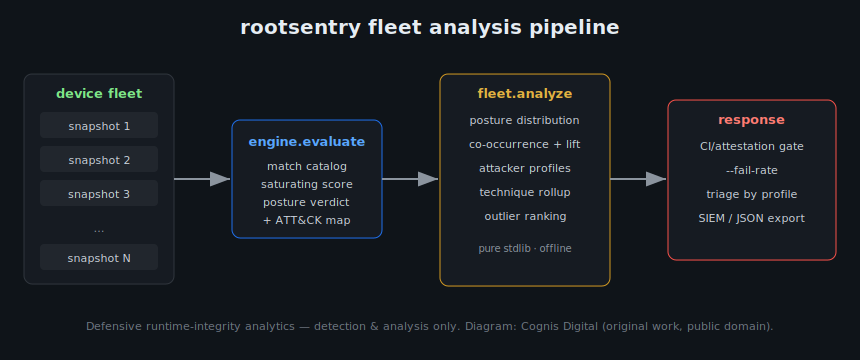

# Fleet analysis, attacker profiles, and ATT&CK mapping

> Defensive runtime-integrity analytics for apps you own/operate. Detection and
> analysis only — rootsentry never modifies a device.

A single-device verdict answers *"can I trust this one runtime right now?"* That
is the right question for an inline RASP check. But once you operate an app — or
an attestation backend — at scale, you are drowning in verdicts and the useful
questions become **population** questions:

- What share of the fleet is COMPROMISED/CRITICAL, and is it drifting week over
  week after a release?
- Which indicators **co-occur**? Real attacker toolkits leave correlated
  fingerprints. A lone `su` binary is often just an enthusiast's daily driver.
  `Magisk` + `LSPosed` + `frida-gadget` staged together is somebody actively
  instrumenting your app. Co-occurrence is far harder to spoof than any single
  check, so it is the strongest signal you have.
- Which **attacker profile** is each bad device exhibiting, so triage and
  response can be templated instead of done device-by-device?
- Which devices are **outliers** — many low-weight oddities that no single rule
  escalates, but that together look engineered?

`rootsentry.fleet` answers all four, offline, from the same `Evidence` snapshots
the engine already scores.



*Diagram: Cognis Digital, original SVG, released to the public domain.*

---

## Real-use-case walkthrough: triaging a post-release spike

You shipped v4.2 of a payments app on Monday. By Wednesday your attestation
backend has collected ~12,000 evidence snapshots and your fraud team says
chargebacks are up. You pull the day's snapshots into a single JSON array and
run:

```bash
rootsentry fleet wednesday.json
```

```
fleet: 15 devices  compromised-rate 73.3%
posture:
  TRUSTED      4
  SUSPICIOUS   0
  COMPROMISED  0
  CRITICAL    11
attacker profiles:
  [   3] Active dynamic instrumentation (frida/hook)
  [   3] Rooted device running an instrumentation framework
  [   3] Emulator / automation farm
  [   2] Root hidden behind detection-evasion
  [   2] Traffic-interception / analysis setup
  [   2] Repackaged / cloned application
indicator co-occurrence (count, lift):
     3x  lift  5.0  android.emu.generic + android.emu.qemu
     2x  lift  5.0  android.magisk.pkg + android.su.system_xbin
     2x  lift  5.0  android.emu.generic + android.emu.goldfish
ATT&CK techniques:
  [   5] T1404 Exploitation for Privilege Escalation
  [   4] T1630.003 Disguise Root/Jailbreak Indicators
  [   3] T1617 Hooking
outliers (most indicators):
  instr-02             6 signals  score 100
  instr-01             5 signals  score 100
```

*(The numbers above come from the shipped `examples/fleet.android.json`, a
clearly-synthetic fixture, so the walkthrough is reproducible.)*

What this tells you in ten seconds:

1. **The fleet is overwhelmingly compromised** (73%) — this is not noise, it is a
   campaign. A healthy consumer fleet sits in the low single digits.
2. **Three distinct adversary behaviors** are running concurrently: live
   instrumentation, an emulator/automation farm, and repackaged clones. These
   warrant *different* responses, and the profile rollup separates them for you.
3. **The co-occurrence table is the smoking gun.** The emulator props
   (`goldfish`/`generic`/`qemu`) appear together with **lift 5.0** — five times
   more often than chance. That is a farm spinning up identical images, not 15
   coincidentally-weird real phones.

### Drill into the devices

```bash
rootsentry fleet wednesday.json --devices
```

…prints one row per device with its posture, score and matched profile ids, so
you can hand the `emulator_farm` set to fraud, the `dynamic_instrumentation` set
to the security team, and the `repackaged_app` set to legal/takedown.

### Gate CI or a canary on it

```bash
# fail the job if more than 20% of the canary cohort is compromised
rootsentry fleet canary.json --fail-rate 0.2 ; echo "exit=$?"
```

Wire that into a release pipeline and a regression in your anti-tamper posture
(e.g. a new build that a public root-hider suddenly defeats) trips the gate
before you roll out wider.

### Machine-readable for a SIEM

```bash
rootsentry fleet wednesday.json --json --devices > fleet.json
```

The JSON includes `posture_counts`, `category_counts`, `technique_counts`
(with ATT&CK names), `profile_counts`, the full `cooccurrence` matrix with lift,
ranked `outliers`, and per-device detail. Ship it straight to Splunk/Elastic.

---

## How co-occurrence + lift work

For every pair of indicators *(A, B)* we count how many devices show both, then
compute

```
lift(A,B) = P(A and B) / ( P(A) * P(B) )
```

- **lift ≈ 1** — A and B are independent. They happen to both be common.
- **lift > 1** — A and B show up together *more than chance predicts*. They
  belong to the same toolkit / fingerprint. This is what you hunt.
- **lift < 1** — A and B avoid each other (e.g. two mutually-exclusive emulator
  hardware strings).

We only surface pairs seen at least `cooccurrence_min_count` times (default 2) so
a one-off coincidence never makes the table. The result is sorted by count then
lift, so the densest, most-confident clusters are on top.

Why this matters defensively: single indicators are cheap to hide. Public
root-hiding modules exist specifically to make `su` invisible. But hiding the
*entire correlated set* — su **and** the Magisk runtime dir **and** the renamed
manager package **and** a permissive-SELinux boot prop — is much harder, and the
attempt to hide some-but-not-all of them is itself a tell (that is the
`evasive_root` profile).

---

## Attacker profiles

A profile fires when **every** one of its `requires_any` groups is satisfied,
where each group is an OR over signal ids. This encodes *"toolkit A **and**
toolkit B were both present"* — the AND-of-ORs structure that distinguishes a
serious setup from an incidentally-odd device.

| Profile | Severity | Fires when… |
|---|---|---|
| `dynamic_instrumentation` | critical | any live hooking/instrumentation framework (frida, Xposed/LSPosed, Substrate/Substitute, dyld insert) is present |
| `rooted_and_hooked` | critical | root/jailbreak **and** a hooking framework — device fully owned and being instrumented |
| `emulator_farm` | high | runtime presents as an emulator; a fleet-scale spike = fraud/automation farm |
| `repackaged_app` | critical | signature mismatch / integrity failure / packer — the binary was modified |
| `mitm_analysis` | high | proxy/user-CA/debugger **and** elevated access — the classic traffic-interception rig |
| `evasive_root` | high | root **and** anti-detection (renamed Magisk, permissive SELinux) — a knowledgeable adversary |

Profiles are deliberately conservative about the AND groups. `mitm_analysis`
will **not** fire on a user-installed CA alone — corporate MDM does that
legitimately. It needs the CA/proxy *and* elevated access, which is the
combination that actually indicates someone rewriting your traffic.

---

## ATT&CK for Mobile mapping

Every fired indicator is annotated with the MITRE ATT&CK for Mobile technique(s)
it evidences, so your fleet report speaks the same language as the rest of your
detection stack. The mappings are real, documented technique IDs:

| Technique | Name | Example rootsentry signals |
|---|---|---|
| T1404 | Exploitation for Privilege Escalation | `android.su.*`, `android.magisk.pkg`, `ios.cydia.app` |
| T1630.003 | Disguise Root/Jailbreak Indicators | `android.magisk.repackaged`, `android.magisk.path` |
| T1617 | Hooking | `android.frida.*`, `android.xposed.pkg`, `ios.mobilesubstrate` |
| T1631 / T1631.001 | Process Injection / Ptrace System Calls | `android.frida.maps`, `android.ptrace.tracerpid` |
| T1633.001 | Virtualization/Sandbox Evasion: System Checks | `android.emu.*` |
| T1406.002 | Software Packing | `any.packer.detected` |
| T1577 | Compromise Application Executable | `any.signature.mismatch`, `any.integrity.fail` |
| T1661 | Application Versioning | `any.signature.mismatch` |

```bash
rootsentry attack            # technique -> signal crosswalk
rootsentry attack --json
```

This crosswalk is also wired to the bundled ATT&CK for Mobile feed
(`datafeeds.py` / `data_feeds_2026.json`, feed id `attack-mobile`) so an
air-gapped deployment can refresh the technique catalog over sneakernet and keep
the names current. Feed access is offline-first and cached; the test suite uses a
committed STIX fixture and never touches the network.

> Source for technique IDs/names: <https://attack.mitre.org/matrices/mobile/>.
> Used here for defensive enrichment/mapping only.

---

## Threat & defensive context (frank)

This is security tooling, so be clear-eyed about what it can and cannot do.

**What an on-device check is up against.** Anything that runs inside an
environment the attacker controls can, in principle, be defeated. A rooted phone
running a hooking framework can patch your detection routine to always return
"clean", spoof file-existence checks, and feed your collector fabricated
properties. There is no on-device check that is unbeatable. rootsentry does not
pretend otherwise.

**Why it still works, in practice.** Defense here is economics, not absolutes.

- **Raise the cost.** Defeating *one* check is cheap. Defeating dozens of
  heterogeneous checks (files, packages, props, ports, in-memory maps, ptrace
  state, boot state) *and* keeping their **co-occurrence** statistically clean
  across a fleet is expensive and brittle. Attackers slip.
- **Move the decision off the device.** The recommended pattern is: collect
  on-device, attest the payload inside Play Integrity / DeviceCheck, send to your
  backend, and run `rootsentry eval`/`fleet` **server-side**. The verdict is then
  made somewhere the attacker does *not* control, using telemetry whose integrity
  is vouched for by the platform attestation.
- **Analyze the population, not the device.** A single spoofed-clean snapshot is
  invisible. A farm of 4,000 snapshots that are *too* clean, or that share an
  improbable indicator cluster, lights up in `fleet` analysis. The attacker has
  to win at the device level *and* the statistical level.

**Honest limitations.**

- Indicators are heuristics, not proofs. `busybox` exists on some legitimate
  power-user setups; a user-installed CA is normal under corporate MDM. That is
  exactly why scoring is *saturating* and why the high-confidence calls come from
  weight-10 signals (signature mismatch) and from co-occurrence, not from any
  single medium-weight file path.
- The catalog covers well-known, publicly-documented indicators. A bespoke,
  never-seen rootkit that leaves none of them will score TRUSTED. Pair rootsentry
  with platform attestation; do not treat it as the sole control.
- Emulator detection flags *emulators*, which are also how QA and accessibility
  tooling run. Treat `emulator_farm` as "investigate", weighted by your app's
  expected real-device ratio — not as an automatic ban.

**Scope.** Defensive runtime self-protection (RASP-style) for apps you own or
operate, plus device-posture analysis during authorized assessments. Detection
and analysis only.
